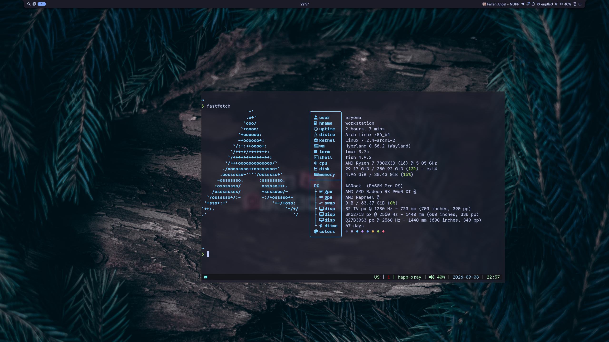
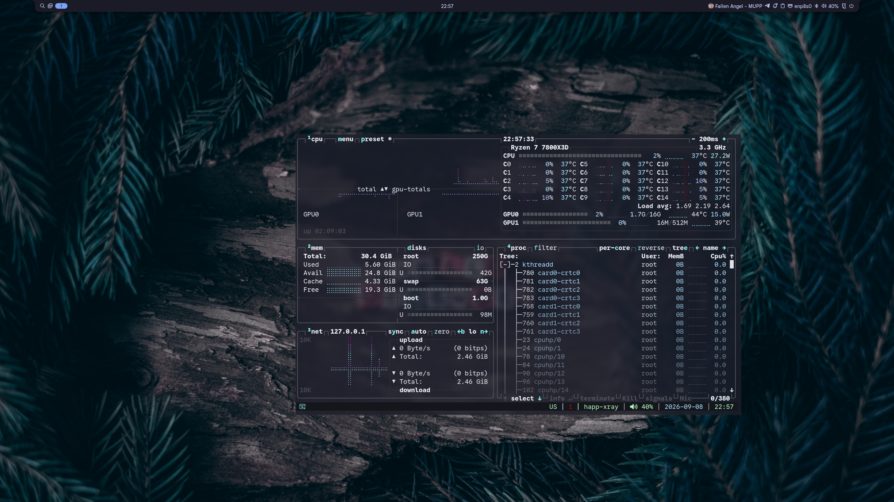
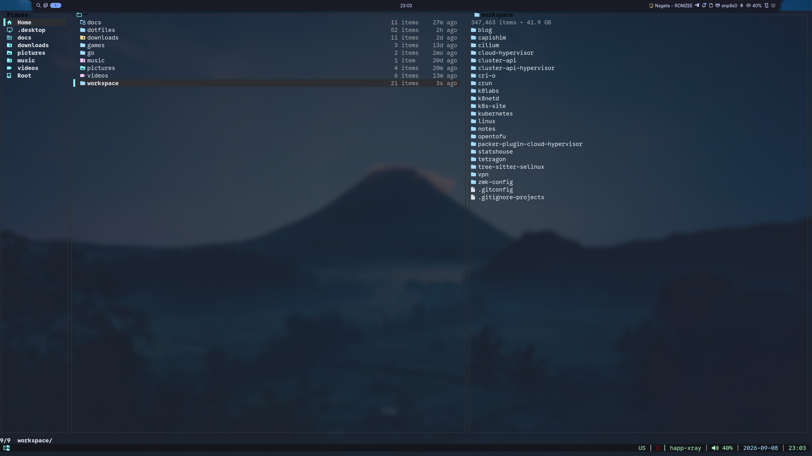
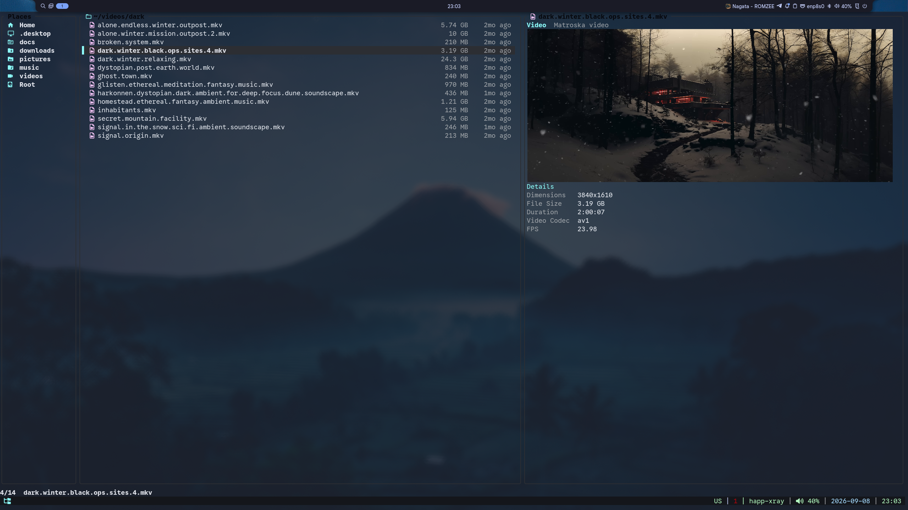
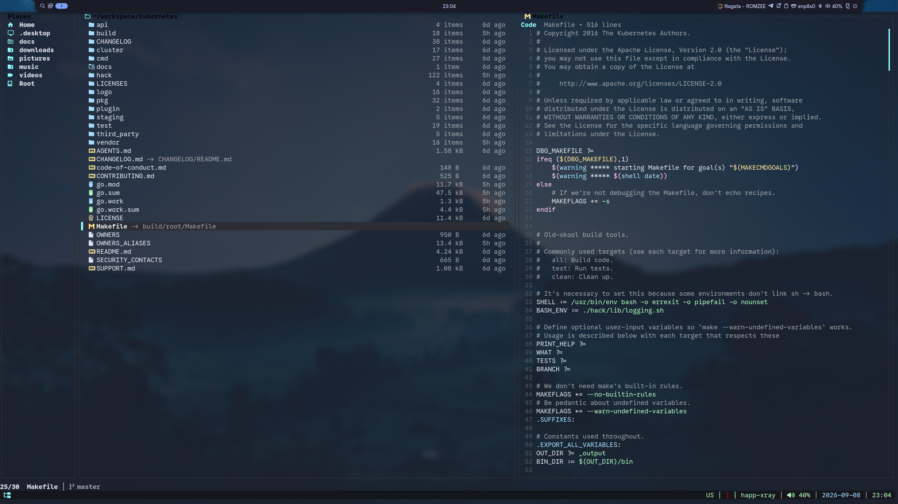
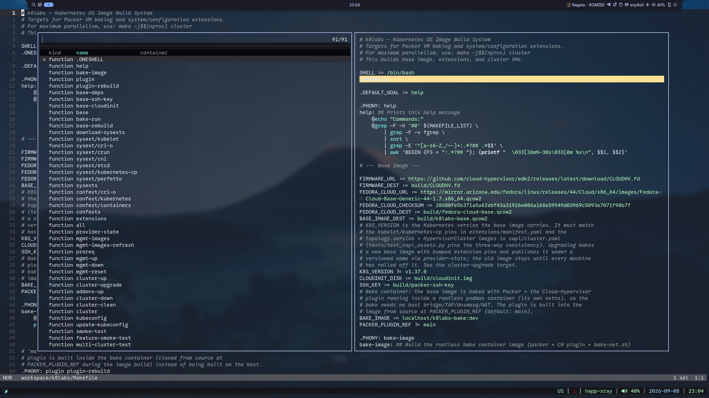
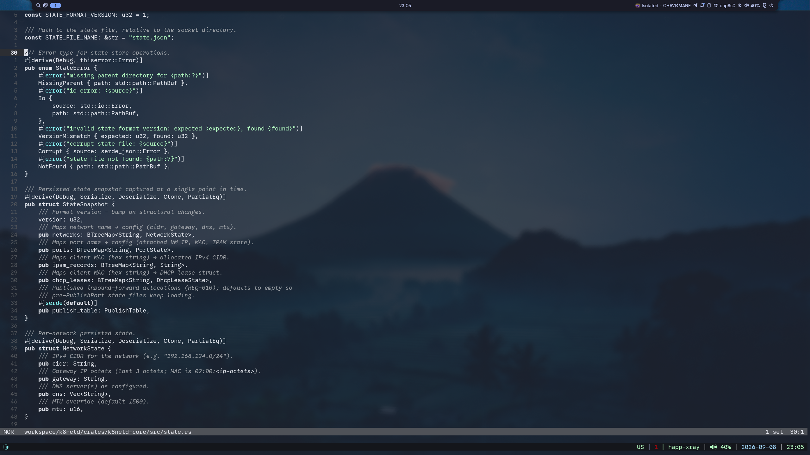
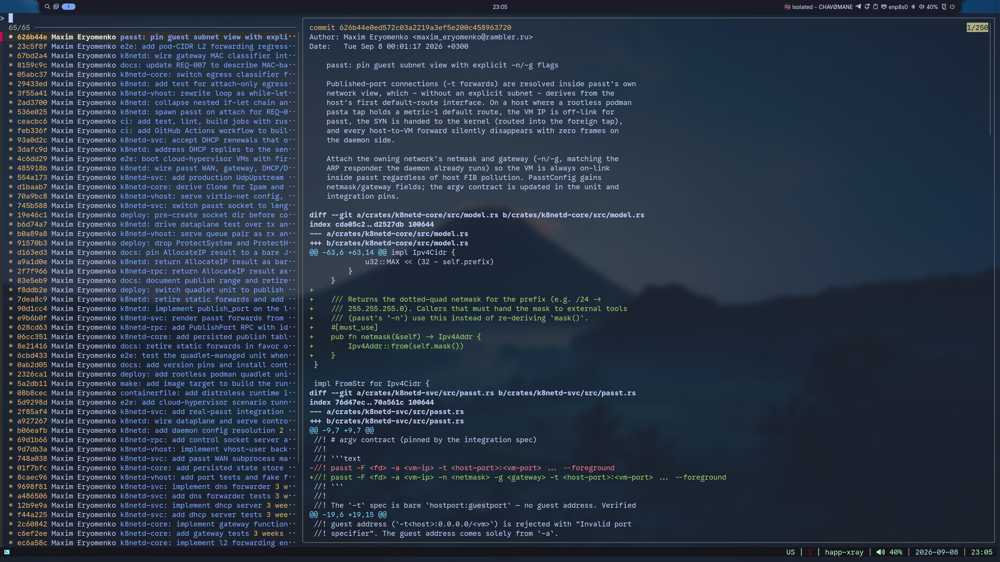
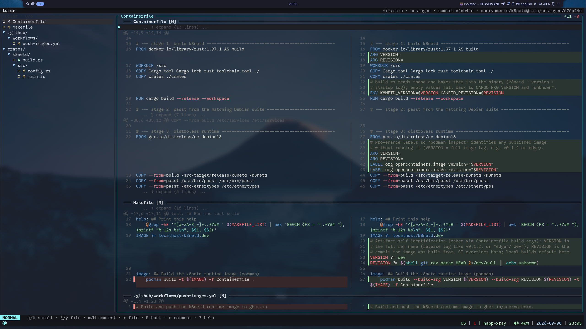

# Collections personal dot files

Configurations for applications managed by [GNU Stow](https://www.gnu.org/software/stow/)



















## Cleanup System

A Bash script that clears package-manager caches, tool/build caches, runtime caches, and trash/misc data. Dry-run by default; `--apply` performs deletion. Wired to a weekly systemd user timer that runs dry-run only.

### Stow packages

| Package | Installs to |
|---------|-------------|
| `bin` | `~/.local/bin/cleanup` |
| `conf` | `~/.config/cleanup/config` |
| `systemd` | `~/.config/systemd/user/cleanup.service`, `~/.config/systemd/user/cleanup.timer` |

### Install

```
cd ~/dotfiles
stow bin conf systemd
systemctl --user daemon-reload
systemctl --user enable --now cleanup.timer
```

The timer runs `cleanup --dry-run --yes` weekly on Monday at 07:00 (`Persistent=true`). It never deletes anything.

### Usage

```
cleanup [OPTIONS]
```

| Flag | Description |
|------|-------------|
| `--apply` | Perform actual deletion (default is dry-run) |
| `--dry-run` | Explicit dry-run (same as default) |
| `--only <cat1,cat2>` | Run only the listed categories (comma-separated) |
| `--category <name>` | Run a single category |
| `--all` | Run all categories (same as default) |
| `--list` | Print categories, enabled state, and config values; exit |
| `--yes` | Skip confirmation prompts (used by the timer) |
| `--verbose` | Print per-path detail in addition to summaries |
| `--install` | Print stow + systemctl install commands; exit |

Categories: `pkgmanagers`, `toolbuild`, `runtime`, `trashmisc`

Config: `~/.config/cleanup/config` (key=value, sourced if present)
Log: `~/.logs/cleanup.log` (truncated when larger than 1MB)
